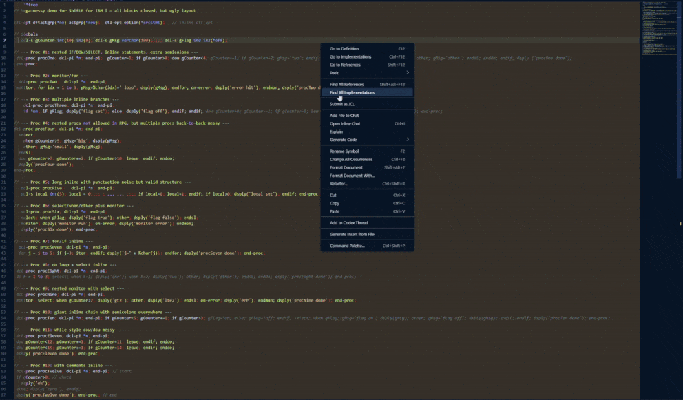

## Shift6 Formatter: Praezise Einrueckung fuer IBM i RPG Free

---

### I. Zusammenfassung

Der **Shift6 Formatter** richtet RPG-Free-Code in VS Code automatisch so ein, wie es der IBM i Compiler erwartet: `**FREE` steht in Zeile 1, alle weiteren Zeilen erhalten den noetigen 6-Spaces-Offset. Das spart manuelle Arbeit, verhindert Formatierungsfehler und haelt den Code auch auf dem Green Screen lesbar. Zusaetzlich sorgt der Formatter dafuer, dass IBM i-Entwickler den vollstaendigen Code sehen (auch die in PDM/SEU ausgeblendeten ersten 5 Spalten), indem er den notwendigen 5 + 1-Spaces-Offset setzt: fuenf fuer die ausgeblendeten Spalten und ein zusaetzliches Space fuer bessere Lesbarkeit beim Schreiben von RPG-Free-Membern in VS Code.


---

### II. Kernfunktionen und Nutzen

**A. Feature-Uebersicht**

- **Ein-Klick-Formatierung:** Shortcut oder Kontextmenue formatiert das gesamte Dokument.  
  - *Mehrwert:* Schneller Workflow, keine manuelle Zeilenkorrektur.
- **Compiler-Sicherheit:** `**FREE` bleibt in Spalte 1, doppelte Marker werden entfernt.  
  - *Mehrwert:* Kein Kompilierungsrisiko durch verrutschte Direktiven.
- **Intelligentes Beibehalten:** Bereits korrekt eingerueckte Zeilen bleiben unberuehrt.  
  - *Mehrwert:* Vorhersehbare Ergebnisse; minimale Diffs.
- **Block-Indent:** Zusaetzliche Einrueckung pro Schachtelung fuer IF/DOW/DOU/FOR/SELECT/MONITOR/BEGSR/DCL-PROC.  
  - *Mehrwert:* Lesbare Schachtelungen, ohne bestehende Struktur zu zerstoeren.
- **Semikolon-Splitting:** Jede Anweisung endet auf eigener Zeile; Mehrfach-`;` werden bereinigt.  
  - *Mehrwert:* Klar getrennte Statements, auch wenn sie inline geschrieben wurden.
- **Lokal & Remote:** Funktioniert auf lokalen Dateien (`file:`), unsaved Tabs und IBM i Remote Members (z.B. Code for IBM i `ibmi:` / `vscode-vfs:` URIs).  
  - *Mehrwert:* Direkt auf dem Host formatieren, ohne den Member herunterladen zu muessen.
- **Whitespace-Normalisierung:** Mehrfach-Spaces zwischen Tokens werden auf eines reduziert (z.B. `dcl-pi    *n;` -> `dcl-pi *n;`, `if   flag = 0;` -> `if flag = 0;`) und Spaces in string-only Klammern werden getrimmt `(   'error'  )` -> `('error')`.  
  - *Mehrwert:* Konsistente Lesbarkeit und kleinere Diffs, ohne String-Inhalte anzutasten.
- **Exec SQL Formatierung:** Strukturierte Layouts fuer `exec sql` Bloecke (DML/DDL, Cursor, Dynamic SQL, Diagnostics, DB2-i Hints, PSM/Trigger Bodies).
  - *Mehrwert:* Gut lesbares Embedded SQL ohne RPG-Struktur zu zerstoeren.

**B. Einstellungen**

- `shift6.collapseTokenSpaces` (Standard: `true`): Schaltet das Reduzieren mehrfacher Leerzeichen zwischen Tokens auf ein Leerzeichen.  
- `shift6.trimStringParentheses` (Standard: `true`): Entfernt Leerzeichen direkt innerhalb von Klammern, wenn darin nur ein String literal steht.  
- `shift6.alignPlusContinuation` (Standard: `true`): Richtet Zeilen, die mit `+` beginnen, unter dem ersten `+` der vorherigen Zeile aus.  
- `shift6.continuationColumn` (Standard: `66`, Minimum: `40`): Spaltengrenze, ab der lange Ausdruecke mit Operatoren in eine neue Fortsetzungszeile umgebrochen werden.
- `shift6.joinAsteriskTokensInDecl` (Standard: `true`): Verbindet Tokens nach `*` in `DCL-PI`/`DCL-PR`/`DCL-PROC`/`CTL-OPT`-Zeilen (z.B. `*n`, `*no`, `*new`).
- `shift6.wrapLongStrings` (Standard: `false`): Lange String-Literale in Konkatenationen umbrechen (nur an Leerzeichen).
- `shift6.fixMultilineStringLiterals` (Standard: `true`): Multi-Line-String-Literale (mit einfachen Quotes) in explizite Konkatenationen umwandeln.
- `shift6.concatStyle` (Standard: `compact`): Style fuer String-Konkatenationen (`compact` oder `one-per-line`).

Neu in 0.1.18: String-Konkatenations-Styles, optionales Long-String-Wrapping, Multiline-String-Normalisierung, verbesserte Continuations.

**C. Git Hook (optional)**

- Pre-Commit-Typecheck: `git config core.hooksPath .githooks` aktiviert den Hook; er ruft `npm run typecheck` auf. Ueberspringbar per `SKIP_SHIFT6_PRECOMMIT=1`.

---

### III. Implementierung und Nutzung

#### A. Installation
1. VSIX beziehen/bauen (z.B. `shift6foribmi-0.1.0.vsix`).
2. In VS Code: Command Palette (`Ctrl+Shift+P` / `Cmd+Shift+P`) oeffnen.
3. `Extensions: Install from VSIX...` ausfuehren und die Datei waehlen.

#### B. Ausfuehrung
Beliebige geoeffnete RPG-Free-Datei formatieren:
- **Shortcut (empfohlen):**  
  - Windows / Linux: `Shift` + `Alt` + `F`  
  - macOS: `Shift` + `Option` + `F`
- **Kontextmenue:** Rechtsklick im Editor -> **Format Document**.
- **Command Palette:** `Ctrl` + `Shift` + `P` -> **Format Document**.

> Wenn mehrere Formatter installiert sind, **Format Document With...** waehlen und **Shift6 Formatter** auswaehlen.

---

### IV. Entwicklerhinweise

> **Arbeitsstandard:** In VS Code immer in Spalte 1 beginnen. Shift6 fuegt beim Formatieren den 6-Spaces-Offset hinzu.  
> **Green-Screen-Lesbarkeit:** Falls ohne VS Code am Green Screen nachgebessert wird, bleibt der Code dank 6-Spaces-Offset lesbar (erste 5 Spalten sind dort ausgeblendet).

> **Schnelle Rule-Checks:** `npm run test:rules` fuer einen schnellen Sanity-Check der Kernregeln.
> **Exec SQL Scope:** Siehe `docs/exec-sql-scope.md` fuer die komplette Abdeckung.

---

### V. Version und Beitraege

**Maintainer**

- Levent Akdogan (Lakdogan) - Autor, Architektur, Wartung.

#### V.I. Changelog
- Vollstaendige Release-Historie in `CHANGELOG.md`.

#### V.II. Beitragende
- Levent Akdogan (Lakdogan) - Architektur und Wartung.

---

### VI. Beitraege & Issue-Meldungen

Shift6 nutzt strukturierte GitHub-Issue-Templates, um die Kommunikation schlank zu halten und den Entwicklungsfluss reibungslos zu gestalten.

- **Bug Reports:** Bitte mit reproduzierbarem Codebeispiel und Umgebungsdetails.  
- **Feature Requests:** Feature klar beschreiben und den Nutzen fuer den Workflow erlaeutern.

Neues Issue anlegen:  
https://github.com/lakdogan/shift6foribmi/issues/new/choose

---

## VII. Visuelle Demo

Die folgende Animation zeigt einen Formatierungslauf mit Shift6 in Visual Studio Code.


Direkter Link (falls das Bild nicht geladen wird): https://github.com/lakdogan/shift6-formatter/blob/main/raw/HEAD/assets/demo.gif?raw=true

#### Vorher -> Format Document -> Nachher (Beispiel)

Vorher:
```rpg
**free
// messy demo snippet
ctl-opt dftactgrp(*no) actgrp(*new);
  dcl-s counter int(10) inz(0); dcl-s msg varchar(50);;;; // extra semicolons
dcl-proc demoProc; dcl-pi *n; end-pi;
if counter=0; dow counter<3; counter+=1; if counter=2; dsply('midpoint'); endif; enddo; else; dsply('preset'); endif;
end-proc;
```

Nachher (Basis 6, Block 2):
```rpg
**free
      // messy demo snippet
      ctl-opt dftactgrp(*no) actgrp(*new);
      dcl-s counter int(10) inz(0); dcl-s msg varchar(50);
      dcl-proc demoProc;
        dcl-pi *n;
        end-pi;
        if counter = 0;
          dow counter < 3;
            counter += 1;
            if counter = 2;
              dsply('midpoint');
            endif;
          enddo;
        else;
          dsply('preset');
        endif;
      end-proc;
```
